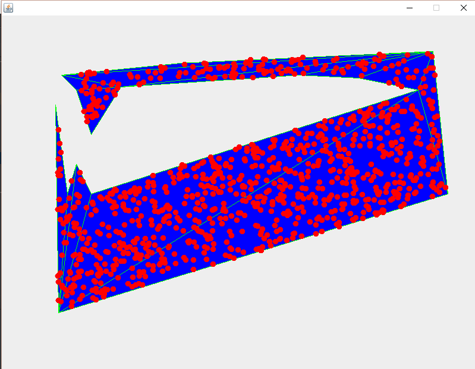

# Generating Random Point Inside Polygon
> This is programm which let you generate random point inside any shape polygon

> Huge thanks to dyn4j library from which I used triangulation: 
> https://github.com/wnbittle/dyn4j

> Example:

